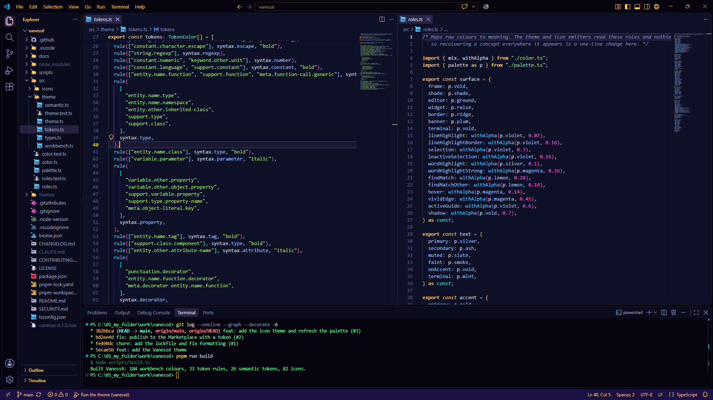

# vanesse

**Vanessë** is a bold dark colour theme for Visual Studio Code, with a matching file icon
theme. Gold, violet and cyan sit on a deep violet night sky, a lemon cursor and magenta edges
mark where you are, and every file in the explorer gets its logo on a soft cloud badge.



## Install

Search for **Vanessë** in the Extensions view, or from a terminal:

```sh
code --install-extension davidkoen.vanesse
```

Then, from the Command Palette:

- **Preferences: Color Theme**, and choose **Vanessë**
- **Preferences: File Icon Theme**, and choose **Vanessë Icons**

The two are independent, so either works on its own. The same package is published to
[Open VSX](https://open-vsx.org/) for VSCodium and other compatible editors.

## The palette

| Name | Hex | Carries |
|---|---|---|
| Silver | `#DCE3F2` | Variables, primary text |
| Slate | `#8A93BF` | Comments, in italic |
| Gold | `#FFCB5C` | Keywords, tags, headings, title and status bar text |
| Sky | `#5CC8FF` | Functions, links |
| Teal | `#3FE6C4` | Types, classes, components |
| Lime | `#A5E86B` | Strings, additions |
| Violet | `#B794FF` | Parameters, attributes, selection |
| Mist | `#9FC2FF` | Properties, object keys |
| Amber | `#FF9E57` | Regular expressions, decorators |
| Lemon | `#FFE93D` | Cursor, find matches, escape sequences, the selected file |
| Magenta | `#FF5CCB` | Numbers, constants, badges, active tab and panel edges |
| Cyan | `#2EF0F0` | Focus rings, information |
| Mint | `#6BFF9C` | Terminal text |
| Red | `#FF4F64` | Errors, deletions |
| Orange | `#FFAE3D` | Warnings, modifications |
| Pink | `#FFA8DC` | Hints |

Surfaces run from `#06050F` at the window frame to `#0D1026` behind the code, with a plum
`#1C1045` status bar.

Weight carries structure as well as colour. Control flow such as `if` and `return`, class
names, constants and tags are bold. Storage words such as `class` and `async`, parameters,
attributes, decorators and comments are italic.

## File icons

**Vanessë Icons** has 82 icons mapped across about 190 file names, extensions and folder
names: languages, frameworks, build tools, config and data formats, and repository files such
as lockfiles, `.env` and `.github`. Each is a logo on a soft cloud badge, coloured from the
theme's palette rather than each brand's own colours, so the explorer reads as one piece.

VS Code draws file icons at 16px, so the logo fills most of the badge and the cloud sits
behind it. See [ADR 0007](docs/adr/0007-cloud-badge-icon-theme.md).

## Recommended settings

A theme can only set colours and icons. These optional settings suit it:

```jsonc
{
  "editor.cursorStyle": "block",
  "editor.cursorBlinking": "phase",
  "editor.fontLigatures": true,
  "editor.fontFamily": "'Monaspace Argon', Consolas, monospace"
}
```

[Monaspace](https://monaspace.githubnext.com/) is a free monospaced type family from GitHub,
under the SIL Open Font License. Install it on your system first. VS Code does not download
fonts.

## Accessibility

Every syntax colour clears WCAG AA, 4.5:1, against the editor background and the
current-line highlight, and at least 3:1 inside a selection. Interface text, focus rings,
diagnostics and terminal colours are held to the same floors on every surface they sit on,
including the plum status bar.

These are not guidelines. `pnpm test` measures them and CI fails if a change breaks one.
The numbers are in [ADR 0003](docs/adr/0003-colour-system.md).

Line numbers and ignored files are the deliberate exception, held to 3:1 so the gutter
stays quiet.

## Privacy and security

Vanessë is theme data and nothing else. It declares no entry point, so VS Code never runs
code from it. It requests no permissions, makes no network requests and collects no
telemetry. The published package holds only the two theme files, the icon SVGs and the
docs, and CI fails if anything else would ship. See [SECURITY.md](SECURITY.md).

## Stack

| Layer | Choice |
|---|---|
| Output | Colour theme and file icon theme JSON, plus icon SVGs, generated at build time |
| Source | TypeScript, `strict`, run directly by Node's type stripping |
| Icons | [Simple Icons](https://simpleicons.org/) logo paths, CC0, rendered at build time |
| Runtime | Node 24, pinned in `.node-version` |
| Tests | `node:test`, including WCAG contrast assertions |
| Lint + format | Biome |
| Packaging | `@vscode/vsce` for the Marketplace, `ovsx` for Open VSX |
| Package manager | pnpm |

There are no runtime dependencies, and nothing in `devDependencies` ships. See
[`docs/adr/`](docs/adr) for why each was chosen.

## Getting started

```sh
pnpm install
pnpm build
```

Open the folder in VS Code and press **F5**. An Extension Development Host opens with both
themes loaded. Pick them with **Preferences: Color Theme** and **Preferences: File Icon
Theme**.

Run `pnpm run build:watch` alongside it to regenerate on every save, then run
**Developer: Reload Window** in the host to see the change.

## Scripts

| Command | Does |
|---|---|
| `pnpm build` | Generate the colour theme, icon theme and icon SVGs under `themes/` |
| `pnpm run build:watch` | Regenerate on every save under `src/` or `scripts/` |
| `pnpm run typecheck` | `tsc`, no emit |
| `pnpm lint` | Biome lint and format check |
| `pnpm run lint:fix` | Apply Biome's safe fixes |
| `pnpm test` | Unit tests, icon checks and the contrast floor |
| `pnpm run check:package` | Fail if the VSIX would contain anything outside the allowlist |
| `pnpm run package` | Build `vanesse-<version>.vsix` |
| `pnpm verify` | Types, lint, tests, build and the package check. Run before opening a PR |

## Project structure

```text
src/
├── palette.ts          Raw colours. The only hex values in the repo
├── roles.ts            What each colour means: surface, text, accent, syntax, signal, icon
├── color.ts            WCAG contrast, alpha and mixing
├── theme/
│   ├── workbench.ts    Interface colours
│   ├── tokens.ts       TextMate scope rules
│   ├── semantic.ts     Semantic token colours
│   ├── theme.ts        Assembles the three into one colour theme
│   └── types.ts        The VS Code theme format
└── icons/
    ├── badge.ts        Renders a glyph onto the cloud badge
    ├── glyphs.ts       The logo and colours behind every icon
    ├── generic.ts      Original drawings where no logo exists
    └── icon-theme.ts   File, extension and folder name mappings
scripts/
├── build.ts            Writes both themes and every icon SVG
└── check-package.ts    Package allowlist guard
themes/                 Generated, gitignored
docs/
├── adr/                Architecture decision records
└── architecture.md     How the pieces fit
```

Tests sit beside the file they test, as `<name>.test.ts`.

**Hex values live in `src/palette.ts` and nowhere else.** The emitters in `src/theme/` and
`src/icons/` read roles, never the palette. Both rules are enforced by tests.

## Contributing

See [CONTRIBUTING.md](CONTRIBUTING.md) for branch naming, commit format and the pre-PR
checklist.

## Continuous integration

Every pull request into `main` runs [`.github/workflows/ci.yml`](.github/workflows/ci.yml):

| Step | Does |
|---|---|
| Types | `tsc` against the strict, erasable-only config |
| Lint and format | Biome |
| Tests | Colour maths, theme and icon validity, and the contrast floor |
| Package allowlist | Fails if the VSIX would carry anything but the themes, icons and docs |
| Package | Builds the VSIX and attaches it to the run, so a PR can be installed and tried |

## Publishing

Releases are cut by tag and published by
[`.github/workflows/release.yml`](.github/workflows/release.yml). Bump `version` in
`package.json` and add a matching `CHANGELOG.md` entry in a pull request. Once it is merged:

```sh
git checkout main
git pull
git tag v0.2.0
git push origin v0.2.0
```

| Job | Does |
|---|---|
| Verify | Reruns CI against the tagged commit and builds the VSIX |
| Check release | Fails unless the tag matches `package.json` and `CHANGELOG.md` has an entry for it |
| Publish | Waits for approval on the `release` environment, then publishes to the Marketplace and Open VSX |
| GitHub release | Attaches the same VSIX, with the changelog entry as notes |

Open VSX uses trusted publishing, minted from GitHub's OIDC token, so no Open VSX token
exists. The Marketplace uses a `VSCE_PAT` secret that only the approval-gated `release`
environment can read. See [ADR 0006](docs/adr/0006-release-by-tag-with-oidc.md). Both
publish steps skip versions that already exist, so a failed release is re-run from the
Actions tab.

## Logos and trademarks

The file icons use logos from [Simple Icons](https://simpleicons.org/), released under CC0,
recoloured to match the theme. Java, C# and PowerShell use original drawings, because their
owners asked Simple Icons to remove them. All product names and logos are trademarks of their
respective owners, used here only to identify file types. Vanessë is not affiliated with or
endorsed by any of them. See [ADR 0005](docs/adr/0005-neutral-published-names.md).

## Known issues

**pnpm 11 refuses to run until build scripts are decided.** `pnpm-workspace.yaml` allows
`@vscode/vsce-sign`, which fetches its signing binary, and declines `keytar`, a native
keychain module only `vsce login` needs. This project does not use `vsce login`.

**vsce is held on 3.x.** 4.0.0 was published on 2026-09-14 and falls inside pnpm's minimum
release age, which exists to keep freshly published, possibly compromised versions out.
Move to 4.x once it has aged, rather than adding an exclusion.

**vsce runs with `--no-dependencies`.** The theme has no runtime dependencies, so dependency
detection, which shells out to npm, is switched off.

**The identifier is `vanesse`.** npm names, GitHub repositories and Marketplace IDs reject
the diaeresis, so only the display name carries it.

**Line-drawn logos are the faintest icons.** PostgreSQL, MySQL, Laravel, XML and .NET are
drawn in thin strokes, so they are rendered without the sticker outline and still read
lighter than the rest at 16px.

**A Simple Icons upgrade can withdraw a logo.** Simple Icons removes a logo when its owner
asks. `glyphs.ts` imports each logo by name, so an upgrade that drops one fails the type
check rather than shipping a blank icon. The icon then moves to `generic.ts`.
